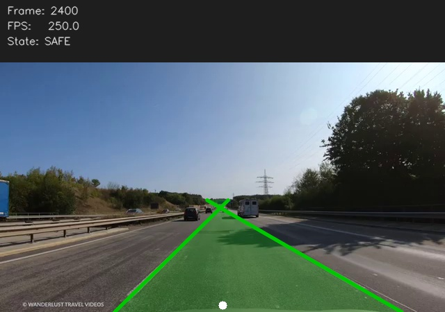

# Lane Detection & Departure Warning

A real-time lane detection and departure warning system built entirely with classical computer vision. No neural network or GPU required.

Detects left and right lane markings using Canny edge detection and Hough transform, then monitors the ego vehicle's lateral position to trigger safety warnings.



## How It Works

The detection pipeline processes each frame in the following steps:

1. ROI trapezoid crop of the bottom 22% of the frame, which excludes sky, gantry signs, and far-field clutter
2. Grayscale conversion and Gaussian blur
3. Canny edge detection
4. Probabilistic Hough transform to extract raw line segments
5. Slope filter that rejects near-horizontal noise and near-vertical vehicle edges
6. Bottom-endpoint x-split to keep left segments on the left and right segments on the right
7. Polyfit averaging to produce one stable line per side
8. Position plausibility check that rejects lines on the wrong side of the frame center
9. Minimum lane width check to reject detections that are too close together
10. Temporal smoothing using a 6-frame rolling average to reduce flicker
11. Line extrapolation up to 58% of frame height for a longer visual display
12. Departure check comparing ego vehicle center against the lane boundaries

### Departure States

| State | Condition | Overlay |
|-------|-----------|---------|
| `SAFE` | Ego center is well within the lane | Green polygon |
| `WARNING` | Ego is within 22% of lane width from a boundary | Yellow polygon with banner |
| `DEPARTURE` | Ego has crossed a lane boundary | Red polygon with alert |
| `NO_LANES` | No markings detected, smoother holds last known position | No overlay |

## Quickstart

```bash
git clone https://github.com/usha-jujjuru/lane-detection-warning.git
cd lane-detection-warning
pip install -r requirements.txt

# Run on sample Autobahn video
python detect_lanes.py --source sample_video/autobahn.mp4

# Run on webcam
python detect_lanes.py --source 0 --show

# Run on IP camera or RTSP stream
python detect_lanes.py --source rtsp://your-camera-ip/stream --show
```

## Usage

```bash
python detect_lanes.py \
  --source         sample_video/autobahn.mp4 \
  --output         output/lane_output.mp4 \
  --smooth-frames  6 \
  --warning-margin 0.22 \
  --show
```

| Argument | Default | Description |
|----------|---------|-------------|
| `--source` | required | Video path, `0` for webcam, or RTSP URL |
| `--output` | output/lane_output.mp4 | Output video path |
| `--smooth-frames` | 6 | Frame buffer size for temporal smoothing |
| `--warning-margin` | 0.22 | Fraction of lane width that triggers a WARNING |
| `--show` | off | Show live display window while processing |
| `--no-stats` | off | Omit the stats panel from the output video |

### Live display controls

| Key | Action |
|-----|--------|
| `q` | Quit |
| `s` | Toggle turn signal to suppress departure warning during intentional lane changes |

## Project Structure

```
lane-detection-warning/
├── lane_detector.py      # Canny and Hough pipeline with slope, position, and width filters
├── departure_checker.py  # Departure state logic with turn signal suppression
├── visualizer.py         # Lane polygon, alert banner, stats panel, and line clipping
├── detect_lanes.py       # Entry point supporting video, webcam, and RTSP sources
├── sample_video/         # Sample Autobahn dashcam clip
├── output/               # Generated output (git-ignored)
├── preview.jpg
└── requirements.txt
```

## Limitations

The following limitations are inherent to the classical Canny and Hough approach. They represent the boundary that motivates deep learning in production ADAS systems.

| Scenario | Behaviour | Root Cause |
|----------|-----------|------------|
| White trucks alongside | Lane line may track the truck bottom edge | White truck paint and white lane markings produce identical gradients in grayscale |
| Road shadows | Shadow boundary may appear as a spurious edge | Canny detects any strong brightness gradient, and shadow transitions resemble lane marking edges |
| Overhead gantry signs | Excluded by raising the ROI top to 78% of frame height | White arrows and text on signs create Hough-detectable lines at lane-like slopes |
| Dense traffic | Lines frozen at last known position via temporal smoother | Vehicles blocking markings completely leave no detectable edges |
| Gentle curves | Polygon drifts as the curve accumulates | Hough fits straight lines only; polynomial fitting is required for curved lanes |
| Worn or faded markings | Reduced detection confidence | Low-contrast markings may fall below the Canny gradient threshold |
| Night without headlights | No detection | Lane markings are not illuminated and produce no detectable gradient |

### Turn signal integration

The `s` key simulates a turn indicator. In a production vehicle, the departure warning is suppressed automatically when the indicator is active, preventing false alerts during intentional lane changes. This is how production LDW systems from Volvo, Mercedes, and BMW handle the same scenario.

## Author

**Usha Rani Jujjuru**
M.Sc. Automotive Software Engineering, TU Chemnitz
Perception Engineer | Computer Vision | ADAS | Autonomous Driving
[LinkedIn](https://linkedin.com/in/usha-rani-jujjuru) · [GitHub](https://github.com/usha-jujjuru)
